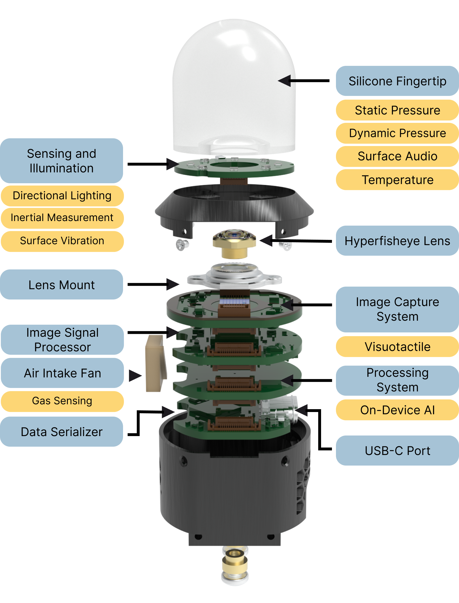

# Digit 360
##### Unlocking new capabilities, and enabling future research on the nature of touch.

<p align="center">
<sub>Mike Lambeta, Tingfan Wu,
Ali Sengül,
Victoria Rose Most,
Nolan Black,
Kevin Sawyer,
Romeo Mercado,
Haozhi Qi,
Chaithanya Krishna Bodduluri,
Alexander Sohn,
Byron Taylor,
Norb Tydingco,
Gregg Kammerer,
Dave Stroud,
Jake Khatha,
Kurt Jenkins,
Kyle Most,
Neal Stein,
Ricardo Chavira,
Thomas Craven-Bartle,
Eric Sanchez,
Yitian Ding,
Jitendra Malik,
Roberto Calandra</sub>
</p>

<p align="center">

</p>

<p align="center">
    <a href="https://ai.facebook.com/research/publications/digitizing-touch-with-an-artificial-multimodal-fingertip"></img></a>
    <a href="https://digit.ml"></img></a>
    <!-- <a href=""></img></a> -->
    <a href="#-citing-digit-360"></img></a>
</p>

Digit 360 is a modular platform which provides rich, multi-modal digital touch-sensing capabilities through a hemispherical compliant embodiment. Digit 360 contains high-resolution sensors (~8.3 million taxels) that respond to omnidirectional touch, capture multi- modal signals, and use on-device artificial intelligence to process the data in real time.

<p align="center">

</p>

## Call for Proposals

AI Research at Meta, in partnership with GelSight Inc., invites proposals from universities and research organizations interested in using the next generation touch sensor Digit 360 to accelerate research, drive open source development, and contribute to the open source community. Fully assembled Digit 360’s will be made available at no charge to researchers that will make rigorous and creative use of the sensor in existing or planned research projects. 

Apply for the [Call for Proposals](https://digit.ml/cfp).

## Digit 360 Overview

The full description of the research methods are found in the [Digit 360 paper](https://ai.facebook.com/research/publications/digitizing-touch-with-an-artificial-multimodal-fingertip)

<p align="center">

</p>

## Digit 360 Design

Digit 360 is composed of a 5 printed circuit board (PCB) stack with a 2 part mechanical housing, a custom hyperfisheye lens, and an artificial fingertip. 

See the design guidelines and design files [README](./design/README.md) for additional information.

## 🛠️ Installation

Please follow the instructions in [this doc](./digit360/README.md) to set up the environment and build the ROS2 package.

## 💻 Setup

We provide two methods for interacting with the Digit 360 devices. 

#### 1. [Standalone Package](./digit360/interface)

It provides python interface for accessing modalities output by digit360. Run the following command to test:
```
python digit360/interface/examples/test_usb.py
```

#### 2. [ROS2 Package](./digit360/ros2)

It provides ros2 interface to publish different modalities output by digit360. Run the following command to test:

```commandline
ros2 launch d360 d360_min_launch.py
```

## RL Environments and Simulation

To faciliate reinforcement learning environments, we provide a set of sectorized and convex meshes described in URDF formats found in the [meshes](./meshes/) folder.

<p align="center">


Both convex and sectorized meshes can be imported into [IsaacSim](https://developer.nvidia.com/isaac/sim).
</p>

## 💡 Multimodal Classification

We provide an example on how to run material / action classifications on touch interactions using the Digit 360.

Please check out [this doc](train/multimodal/README.md) for the detailed instructions.

## Related Works using Digit 360

* [In-Hand Object Rotation via Rapid Motor Adaptation, Haozhi Qi et al.](https://haozhi.io/hora/)
* [General In-Hand Object Rotation with Vision and Touch, Haozhi Qi et al.](https://haozhi.io/rotateit/)

## 📚 Citing Digit 360

If you find this repository useful, please consider giving a star :star: and citation:

```
@inproceedings{lambeta2024digit360,
    title={Digitizing Touch with an Artificial Multimodal Fingertip},
    author={Mike Lambeta, Tingfan Wu, Ali Sengul, Victoria Rose Most, Nolan Black, Kevin Sawyer, Romeo Mercado, Haozhi Qi, Alexander Sohn, Byron Taylor, Norb Tydingco, Gregg Kammerer, Dave Stroud, Jake Khatha, Kurt Jenkins, Kyle Most, Neal Stein, Ricardo Chavira, Thomas Craven-Bartle, Eric Sanchez, Yitian Ding, Jitendra Malik, Roberto Calandra},
    booktitle = {arXiv},
    year = {2024}
}
```

## License
This project is licensed under [LICENSE](LICENSE).


