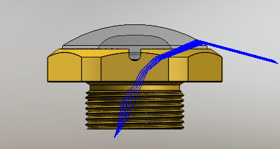

# Digit 360 Design Guidelines

## Fingertip Design and Molds

The fingetip design is included for customization, which allows for alternative shapes of the hemispherical volume providing that the interface to the Digit 360 fingertip [gelsensor](./hardware/templates/gelsensor/) base is used. 

Mold designs can be 3D printed or CNC machined using 6061 aluminum.

* [Mold Design Files](./fingertip/digit360_fingertip_mold.stp)
* [Fingertip Design Files](./fingertip/digit360_fingertip.stp)

## Hardware

Hardware schematics and guidelines for manufacturing are found [here](./hardware/)

## Mechanical

The full Digit 360 design is provided as a `step` file [here](./mechanical/digit360.stp)

## Digit 360 Hyperfisheye Lens

Two custom lenses are designed specficially to highlight features important to visuotactile capture. The Digit 360 lenses can be manufacutred by single point diamond turning (SPDT) or injection molding techniques.

#### [Injection Molded Lens](digit360_lens.stp)
* With each element exposed in the [elements](./elements/) folder.

#### [SPDT Lens](./spdt/digit360_spdt_lens.STEP)

See the [CONTRIBUTING](CONTRIBUTING.md) file for how to help out.

## License
Digit 360 is Attribution-NonCommercial 4.0 International licensed, as found in the [LICENSE](LICENSE) file.